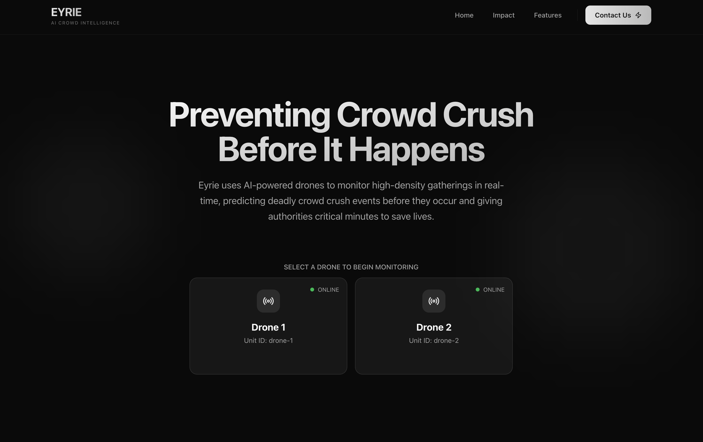

# Eyrie - Preventing Crowd Crush Before It Happens

Best Use of Cloudflare at HackHarvard '25🏆




A project built to monitor high-density gatherings in real-time, detect dangerous crowd formations, and predict deadly crowd crush events before they occur using AI-powered drones.

## Overview

Eyrie automatically streams live video from drones, detects people using YOLOv8, calculates spatial density, and generates predictive alerts.
It helps authorities prevent crowd crush tragedies by providing critical minutes to respond before disaster strikes.


## Features

* Multi-Source Streaming – WebRTC video from drones or cameras with real-time person detection overlays
* YOLOv8 Detection – Uses pre-trained or custom models to detect and track individuals with bounding boxes
* Spatial Analytics – Computes crowd density using Gaussian kernel algorithms with normalized coordinates
* Predictive Alerts – Machine learning algorithms identify high-risk formations before crush events occur
* Live Visualization – Interactive overlays with tracking points, risk heatmaps, and time-series analytics graphs
* Scalable Architecture – Supports multiple simultaneous drone feeds with shared video processing


## Tech Stack

* TypeScript + React + Next.js 15 with `d3.js` for heatmap visualization
* Python `FastAPI` for APIs & `aiortc` for WebRTC streaming
* YOLOv8 (Ultralytics) for real-time person detection
* OpenCV for video processing & PyTorch for ML inference

## Usage
```bash
cd frontend
pnpm install
pnpm dev
